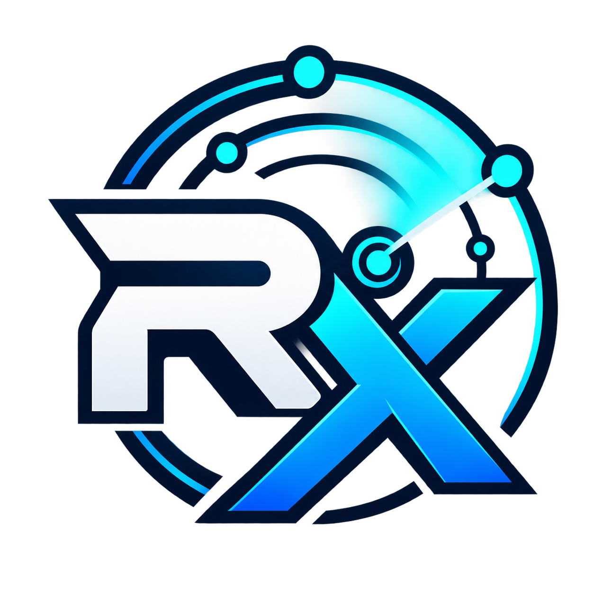
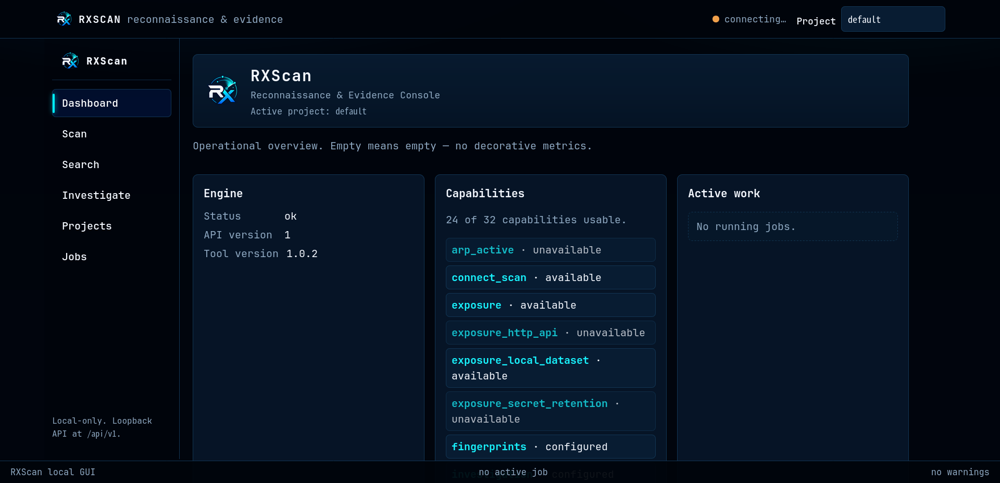

<p align="center">
  
</p>

<h1 align="center">RXScan</h1>

<p align="center">
  <b>Raw Excess Scan</b><br>
  Network reconnaissance, public-source investigation, and evidence correlation in Rust.
</p>

<p align="center">
  <a href="https://github.com/DarkRX1/RXScan/releases"></a>
  
  
  <a href="LICENSE"></a>
</p>

---

RXScan collects reconnaissance data as evidence and keeps observations, sources,
relationships, and conclusions separate.

It includes network scanning, service identification, public-source search,
investigation, persistent projects, evidence correlation, history, and
machine-readable output.

The current development tree also contains a local browser interface backed by
a versioned local API.

RXScan does not treat a port number as a service identity, HTTP `200` as proof
that an account exists, UDP silence as a definite port state, or missing
coverage as a negative finding.

> **Release status**
>
> Published releases and `master` are not always the same build.
> `master` currently contains development work newer than `v1.0.2`.
> Check the release notes and `rxscan --help` for the build you are running.

<p align="center">
  
</p>

<p align="center">
  <sub>RXScan local web console from the current development tree.</sub>
</p>

## Install

RXScan currently targets Linux.

Building from source requires Rust 1.85 or newer.

```bash
git clone https://github.com/DarkRX1/RXScan.git
cd RXScan
cargo install --path . --locked
```

Check the installed binary:

```bash
rxscan --version
rxscan --help
```

When developing RXScan, the repository binary can be run directly:

```bash
cargo run --quiet -- --version
cargo run --quiet -- --help
```

## CLI

The current top-level CLI provides scanning plus search, investigation, project,
and capability workflows.

```text
rxscan TARGET
rxscan search ...
rxscan investigate ...
rxscan project ...
rxscan capabilities
```

Basic scan:

```bash
rxscan example.test
```

Specific ports:

```bash
rxscan example.test --ports 22,80,443
rxscan example.test --ports 1-1024
rxscan example.test --ports 22,80,443,8000-8100
```

Complete TCP port range:

```bash
rxscan example.test --all-ports
```

UDP discovery:

```bash
rxscan example.test --udp
```

Show the selected plan, limits, policy decisions, and excluded capabilities:

```bash
rxscan example.test --explain
```

Workflow-specific help:

```bash
rxscan --help
rxscan search --help
rxscan investigate --help
rxscan project --help
```

The help shipped with the installed build is the source of truth for accepted
commands and options.

## Network reconnaissance

RXScan provides TCP connect scanning and a Linux IPv4 raw SYN path.

```bash
rxscan example.test --scan-mode auto
rxscan example.test --scan-mode connect
rxscan example.test --scan-mode syn
```

Raw SYN scanning depends on runtime capability.

If the requested SYN path cannot be used, RXScan reports the effective behavior
instead of presenting a fallback as a raw SYN scan.

Scan execution is bounded by scheduler limits.

Examples:

```bash
rxscan example.test --max-tasks 5000
rxscan example.test --max-concurrency 16
rxscan example.test --max-hosts 256
rxscan example.test --max-execution-time 60s
rxscan example.test --max-evidence-bytes 64MiB
```

Host discovery can use multiple bounded discovery techniques depending on the
target and available runtime capabilities.

UDP scanning is opt-in:

```bash
rxscan example.test --udp
```

Protocol-aware UDP probes include DNS, NTP, SSDP and additional bounded
protocol probes in the current development tree.

A silent UDP target is kept as uncertainty rather than converted into an open
or closed result.

## Service identification

RXScan identifies services from observed protocol behavior rather than assigning
a service from its port number alone.

Native identification includes:

- SSH
- HTTP and HTTPS
- TLS
- FTP
- SMTP
- Redis
- MySQL
- PostgreSQL
- SMB
- RDP
- MongoDB
- MQTT
- bounded unknown-service fingerprints

Depending on the protocol and evidence returned, observations can include:

- product and version information
- banners
- HTTP endpoints
- page titles
- normalized web technologies
- TLS certificate facts
- SSH identity information

If the available evidence is not sufficient to identify a service, the service
remains unknown.

The identification paths documented here do not require password guessing.

## Public-source search

Username search:

```bash
rxscan search --username exampleuser
```

The current development tree also supports typed search seeds for additional
entity types:

```bash
rxscan search --email user@example.test
rxscan search --domain example.test
rxscan search --hostname api.example.test
rxscan search --ip 192.0.2.10
rxscan search --asn AS64500
rxscan search --url https://example.test
rxscan search --repo example-org/example-project
rxscan search --org example-org
```

Search results preserve result type and uncertainty.

Username results can distinguish between:

| Result | Meaning |
| --- | --- |
| `Profile` | observed identity-specific public profile |
| `Resource` | observed identity-specific resource that is not necessarily a profile |
| `Candidate` | identity-specific location that has not been confirmed |
| `Provider Endpoint` | provider infrastructure rather than an identity profile |

A generic provider homepage or API endpoint is not reported as a confirmed
profile URL.

Blocked, rate-limited, unknown, error, unscanned, and negative outcomes remain
separate states.

Show the complete human result set:

```bash
rxscan search --username exampleuser --all
```

Show additional execution and classification information:

```bash
rxscan search --username exampleuser --explain
```

## Investigation

Investigation correlates public findings into typed entities, relationships,
evidence, and findings.

```bash
rxscan investigate --username exampleuser
```

The normal human view focuses on useful findings and relationships instead of
printing every collected secondary resource.

The underlying evidence remains available to detailed and machine-oriented
paths.

Public-source investigation is passive by default.

Discovering an IP address, hostname, domain, or other network entity through
public evidence does not automatically trigger a network scan.

## Intelligence sources

The current development tree contains intelligence paths for:

- DNS observations
- RDAP
- certificate transparency
- web archives
- repository metadata
- organization metadata
- ASN and prefix information
- routing relationships
- configured passive infrastructure sources
- document metadata
- exposure metadata
- temporal observations
- contradiction tracking

DNS observations can include:

- A
- AAAA
- CNAME
- MX
- NS
- TXT
- PTR
- SRV
- SPF-related data
- DMARC-related data

RDAP paths cover entities including:

- domains
- IP addresses
- ASNs
- prefixes

Availability depends on the source, provider behavior, configuration, and
network access.

An unavailable provider is kept as unavailable rather than converted into a
finding.

Passive observations remain distinguishable from observations made directly by
RXScan against a network target.

## Evidence model

RXScan stores typed evidence for reporting, investigation, project history, and
graph correlation.

The evidence model follows several rules:

- a port number alone does not establish service identity
- HTTP `200` alone does not establish that a public account exists
- UDP silence remains uncertain
- weak identity evidence does not automatically merge entities
- shared infrastructure can create a relationship without proving shared identity
- passive and direct observations remain distinguishable
- incomplete coverage is not proof that a previously observed entity disappeared
- filtering information from human output does not delete the underlying evidence

The graph records relationships and provenance so findings can be traced back
to the observations that produced them.

## HTTP observations

For confirmed web services, bounded HTTP observations can include:

- status
- headers
- redirects
- page title
- content type
- response size
- cookies
- links
- forms
- scripts
- `robots.txt`
- `sitemap.xml`

Workflow and evidence can also permit bounded crawling, baseline checks,
managed content discovery, and contextual GET-query follow-ups.

## TLS observations

TLS observation records handshake and certificate evidence.

It is not an exhaustive cipher-suite enumeration path.

Certificate evidence can also contribute to entity relationships and
investigation data.

## DNS observations

DNS observations are used both for direct reporting and as evidence feeding the
entity graph.

DNS data can create relationships between domains, hostnames, addresses, mail
infrastructure, nameservers, and service records without treating those
relationships as proof of shared identity.

## Local web console

The current development tree contains a local browser interface over the same
RXScan core used by the terminal workflows.

Current views include:

- Dashboard
- Scan
- Search
- Investigate
- Projects
- Jobs

The interface exposes project data including evidence, findings, graph data,
timeline data, and job state.

The local API is versioned under:

```text
/api/v1
```

Live job progress uses server-sent events.

Running jobs can be cancelled through the core cancellation path.

The web service is intended for loopback-local use and applies same-origin
checks.

It does not expose a general command-execution endpoint.

The command advertised by the installed build should be checked through:

```bash
rxscan --help
```

Do not assume a web launch command that is not listed by the build being used.

## Projects and persistence

RXScan can persist correlation data in SQLite project databases.

Example:

```bash
rxscan example.test --project-db project.db
```

Project commands expose persisted reconnaissance and graph operations:

```bash
rxscan project --help
```

Persisted data can be used for later analysis instead of requiring every
observation to exist only in terminal output.

## History and comparison

RXScan supports offline reporting and comparison workflows.

Examples:

```bash
rxscan report scan.rxscan
rxscan diff old.rxscan new.rxscan
```

Historical comparison is coverage-aware.

If a later run did not cover the same target or evidence surface, absence alone
is not interpreted as a confirmed removal.

## Scope

Network activity is subject to RXScan's scope policy.

Permit an additional target or CIDR:

```bash
rxscan example.test --scope example.test
```

Exclude a target or CIDR:

```bash
rxscan example.test --exclude api.example.test
```

Out-of-scope work is rejected before the corresponding network contact.

Scope enforcement reduces accidental contact.

Authorization is still the operator's responsibility.

## Bounded execution

RXScan places explicit limits around work including:

- scheduler admission
- concurrency
- retries
- execution time
- host expansion
- retained evidence
- follow-up work

When a deadline or another execution limit prevents work from running, completed
evidence is retained and unfinished work is accounted for instead of presenting
the run as fully completed.

This applies to partial network scans as well as other bounded workflows.

## Output

Human output is findings-first:

```bash
rxscan example.test
```

Color behavior:

```bash
rxscan --color auto example.test
rxscan --color always example.test
rxscan --color never example.test
```

`--explain` adds planner, policy, accounting, and reasoning information that is
normally omitted from the human view.

Machine-readable scan output is available as JSONL:

```bash
rxscan example.test --format jsonl
rxscan example.test --output scan.jsonl
```

Machine-readable output does not contain terminal ANSI styling.

Supported scan workflows can also write checkpoints:

```bash
rxscan example.test --checkpoint scan.rxscan
```

## Capabilities

Runtime support can be inspected directly:

```bash
rxscan capabilities
```

Capabilities can depend on:

- operating system support
- privileges
- network availability
- configuration
- configured data sources

The capability report reflects the current runtime instead of assuming every
feature is available.

## Current limitations

Current limitations include:

- Linux is the currently documented runtime
- raw SYN scanning is Linux IPv4-specific
- active OS fingerprint coverage is limited
- TLS observation is not exhaustive cipher-suite enumeration
- DNS functionality does not implement every behavior of a dedicated DNS tool
- public-source providers can rate-limit, block, change behavior, or become unavailable
- some intelligence sources require provider-specific configuration
- fingerprint coverage is finite
- protocol coverage is finite
- development functionality on `master` can be newer than the latest published release

These are current implementation limits, not statements about future
functionality.

## Non-goals

RXScan does not provide automatic:

- credential brute forcing
- password guessing
- authentication bypass
- exploitation
- destructive actions
- malware deployment
- session theft

Public-source discovery is not treated as permission to scan discovered
infrastructure.

Use active network functionality only against systems you own or are explicitly
authorized to assess.

## Building from source

Requirements:

- Rust 1.85 or newer
- Linux for the currently supported runtime

Build:

```bash
cargo build --release --locked
```

Run:

```bash
./target/release/rxscan --help
```

Install the local source:

```bash
cargo install --path . --locked
```

Force-reinstall after rebuilding development changes:

```bash
cargo install --path . --force --locked
```

## Testing

Run the test suite:

```bash
cargo test --locked
```

Full project checks:

```bash
cargo fmt --check
cargo check --all-targets --all-features
cargo clippy --all-targets --all-features -- -D warnings
cargo test --locked
git diff --check
cargo run -- search lint
```

Network tests should use deterministic local fixtures rather than arbitrary
public Internet services.

## Releases

Published releases and release notes are available from:

https://github.com/DarkRX1/RXScan/releases

The `v1.0.0` and `v1.0.1` tags were published with incorrect `0.1.0` Cargo
package metadata.

Those historical tags are intentionally left unchanged.

`v1.0.2` is the first correctly versioned 1.x release.

Development on `master` currently contains work newer than `v1.0.2`.

## Roadmap

See:

[`docs/ROADMAP.md`](docs/ROADMAP.md)

The roadmap describes planned work.

Planned items are not current capabilities.

## Contributing

Useful reports include:

- reproducible bugs
- false positives
- false negatives
- service-identification errors
- provider behavior changes
- scope failures
- cancellation failures
- terminal regressions
- web UI regressions
- persistence problems
- migration problems
- documentation errors

For network behavior, prefer deterministic local fixtures.

Detection claims should have executable evidence behind them.

Changes to scanning behavior should preserve scope, deadlines, cancellation,
partial results, and accounting.

## License

MIT. See [`LICENSE`](LICENSE).
